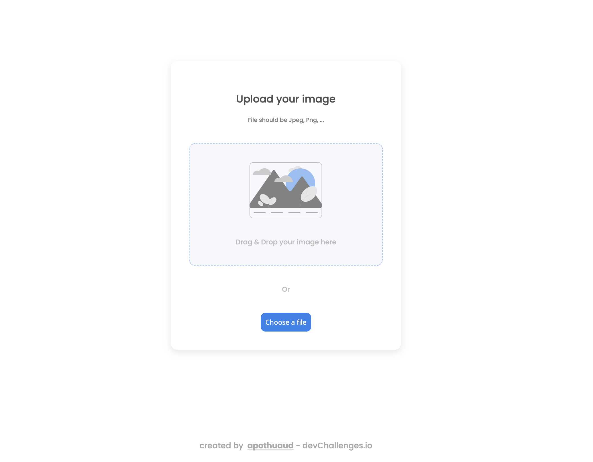

<!-- Please update value in the {}  -->

<h1 align="center">My Image Uploader</h1>

<div align="center">
   Solution for a challenge from  <a href="http://devchallenges.io" target="_blank">Devchallenges.io</a>.
</div>

<div align="center">
  <h3>
    <a href="https://apothuaud-dev-challenges-image-uploader.vercel.app/">
      Demo
    </a>
    <span> | </span>
    <a href="https://devchallenges.io/challenges/O2iGT9yBd6xZBrOcVirx">
      Challenge
    </a>
  </h3>
</div>

<!-- TABLE OF CONTENTS -->

## Table of Contents

- [Overview](#overview)
- [Built With](#built-with)
- [Features](#features)
- [How to use](#how-to-use)

<!-- OVERVIEW -->

## Overview



The demo is deployed using [Vercel](https://vercel.com/) and available on https://apothuaud-dev-challenges-image-uploader.vercel.app/ 

I realized this project in like 4 hours, that was a great experience to try and look around for solutions for file upload using React. Hopefully I found a [very usefull library](https://react-dropzone.js.org/) for the drag and drop zone, and for the classical file input I used a technic I already faced before, an hidden file input with a ref using React hook `useRef`.

I learned to follow a Figma design template to create an App, thing that I've never done before, and it was pretty straight forward due to Figma cool features like CSS properties.

I improved my Cypress skills by trying and implementing file uploads and drag and drop tests. Honestly I don't really know if the drag and drop with Cypress is reproducing the user behavior, but it seems to do the job.

I found this project was very cool, I think I'll try to tackle this project using no framework the next time.

### Built With

<!-- This section should list any major frameworks that you built your project using. Here are a few examples.-->

- [React](https://reactjs.org/)
- [Next.js](https://nextjs.org/)

## Features

<!-- List the features of your application or follow the template. Don't share the figma file here :) -->

This application/site was created as a submission to a [DevChallenges](https://devchallenges.io/challenges) challenge. The [challenge](https://devchallenges.io/challenges/O2iGT9yBd6xZBrOcVirx) was to build an application to complete the given user stories.

I added one more feature that is a reset button to be able to upload a new Image at the end.

## How To Use

To clone and run this application, you'll need [Git](https://git-scm.com) and [Node.js](https://nodejs.org/en/download/) (which comes with [npm](http://npmjs.com)) installed on your computer. From your command line:

```bash
# Clone this repository
$ git clone https://github.com/your-user-name/your-project-name

# Install dependencies
$ npm install

# Environment settings
$ echo "NEXT_PUBLIC_CLOUDINARY_NAME={{your_cloudinary_application_name}}\nNEXT_PUBLIC_CLOUDINARY_API_KEY={{your_cloudinary_api_key}}\nNEXT_PUBLIC_CLOUDINARY_API_SECRET={{your_cloudinary_api_secret}}" .env.local

# Run the app (in dev mode)
$ npm run dev

# Run Cypress tests
$ npm run cypress:run

# Build the app for production
$ npm run build

# Run build output
$ npm start
```
